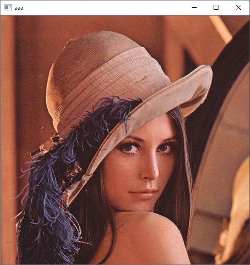
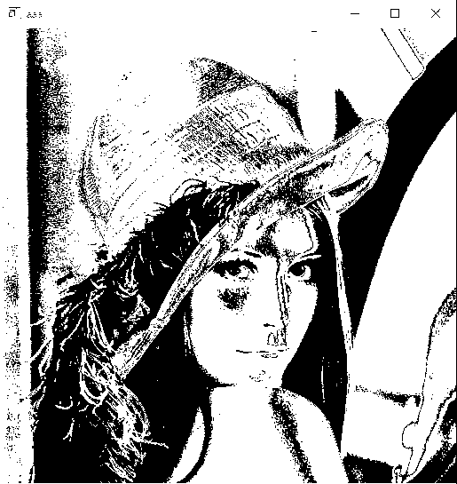

# Conway's Game of Life by GoLang

## Usage
```
C:\work>lifegame
Usage: lifegame image_file
```

## Example
```
C:\work>lifegame photo.jpg
format = jpeg
Min.X = 0
Min.Y = 0
Max.X = 515
Max.Y = 545

C:\work>ls
README.md  lifegame.exe  main.go  out.gif  photo.jpg  stage0.json
```

input image



output image


